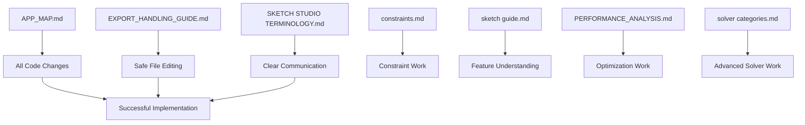

# MD Guides Organization - AI Agent Perspective

## 📊 Usefulness Ranking (For AI Development Tasks)

### 🥇 Tier 1: Essential for Code Understanding & Modification

**1. APP_MAP.md** ⭐⭐⭐⭐⭐
- **Why essential**: Complete application architecture map
- **Use cases**: Understanding data flow, finding where to make changes, debugging
- **Key sections**: Constraint creation paths, file responsibilities, state variables
- **AI benefit**: Tells me exactly where to look for specific functionality

**2. EXPORT_HANDLING_GUIDE.md** ⭐⭐⭐⭐⭐
- **Why essential**: Critical workflow for maintaining source/export sync
- **Use cases**: Making changes safely, understanding project structure
- **Key sections**: Source vs export principles, sync workflow, disaster recovery
- **AI benefit**: Prevents me from breaking the project structure

**3. SKETCH STUDIO TERMINOLOGY.md** ⭐⭐⭐⭐⭐
- **Why essential**: Defines all domain-specific terms
- **Use cases**: Understanding code comments, variable names, feature descriptions
- **Key sections**: Geometry elements, constraints, snapping system, color coding
- **AI benefit**: Ensures I use correct terminology in code and explanations

### 🥈 Tier 2: Important for Feature Development

**4. constraints.md** ⭐⭐⭐⭐
- **Why important**: Documents constraint system logic
- **Use cases**: Adding/modifying constraints, understanding solver behavior
- **Key sections**: Constraint descriptions, solver logic for each type
- **AI benefit**: Helps implement or modify constraint-related features

**5. sketch guide.md** ⭐⭐⭐⭐
- **Why important**: Overview of core features
- **Use cases**: Understanding user-facing functionality
- **Key sections**: Geometric creation tools, constraint system, UI features
- **AI benefit**: Context for what the application should do

### 🥉 Tier 3: Useful for Advanced Tasks

**6. PERFORMANCE_ANALYSIS.md** ⭐⭐⭐
- **Why useful**: Identifies optimization opportunities
- **Use cases**: Performance improvements, understanding bottlenecks
- **Key sections**: Bottleneck analysis, optimization roadmap
- **AI benefit**: Guidance when performance issues are reported

**7. solver categories.md** ⭐⭐⭐
- **Why useful**: Theoretical background on solver strategies
- **Use cases**: Understanding solver architecture, advanced modifications
- **Key sections**: Solver logic strategies, hybrid architectures
- **AI benefit**: Context for how the solver works conceptually

**8. cad dev tech guide.md** ⭐⭐
- **Why less critical**: General CAD development challenges
- **Use cases**: Understanding broader context of CAD development
- **Key sections**: Technical challenges in CAD development
- **AI benefit**: Background knowledge, but not specific to this codebase

## 🗂️ Category Organization

### 📁 **Architecture & Structure**
- `APP_MAP.md` - Application architecture
- `EXPORT_HANDLING_GUIDE.md` - Project structure & workflow

### 📁 **Domain Knowledge**
- `SKETCH STUDIO TERMINOLOGY.md` - Domain-specific vocabulary
- `constraints.md` - Constraint system details
- `sketch guide.md` - Feature overview

### 📁 **Development & Optimization**
- `PERFORMANCE_ANALYSIS.md` - Performance insights
- `solver categories.md` - Solver theory
- `cad dev tech guide.md` - General CAD challenges

### 📁 **AI-Specific Guidance** (New)
- `REFACTOR_SUGGESTIONS.md` - Safe refactoring guidance
- `IMMEDIATE_REFACTORS.md` - Quick, safe changes

## 🔍 Quick Reference Table

| Guide | Primary Use | When to Consult | Key Info for AI |
|-------|-------------|-----------------|-----------------|
| **APP_MAP** | Find code locations | Before ANY code change | Where functions live, data flow |
| **EXPORT_HANDLING** | Safe modifications | When editing files | Source/export relationship |
| **TERMINOLOGY** | Understand terms | When reading code | Domain vocabulary |
| **constraints** | Constraint work | Modifying constraints | Constraint logic |
| **sketch guide** | Feature context | Understanding features | What app should do |
| **PERFORMANCE** | Optimization | Performance issues | Bottlenecks, fixes |
| **solver categories** | Solver changes | Advanced solver work | Solver strategies |
| **cad dev tech** | Background | General understanding | CAD challenges |

## 🎯 AI Agent Workflow Using These Guides

### When Asked to Modify Code:
1. **First**: Check `APP_MAP.md` - find where the functionality lives
2. **Second**: Check `EXPORT_HANDLING_GUIDE.md` - understand safe edit workflow
3. **Third**: Check `SKETCH STUDIO TERMINOLOGY.md` - ensure correct terminology

### When Asked About Features:
1. **First**: Check `sketch guide.md` - feature overview
2. **Second**: Check `constraints.md` - constraint details if relevant
3. **Third**: Check `APP_MAP.md` - implementation details

### When Performance Issues Reported:
1. **First**: Check `PERFORMANCE_ANALYSIS.md` - known bottlenecks
2. **Second**: Check `APP_MAP.md` - find affected code areas

## 📝 Guide Dependencies

## 🚨 Critical Rules for AI Agent

1. **ALWAYS check APP_MAP.md first** before making code changes
2. **NEVER edit export files directly** (per EXPORT_HANDLING_GUIDE.md)
3. **USE correct terminology** from SKETCH STUDIO TERMINOLOGY.md
4. **FOLLOW source → export workflow** for all modifications
5. **REFERENCE constraints.md** when working with constraint system

## 📚 Guide Summaries (For Quick Recall)

### APP_MAP.md
- **One-sentence**: "Where everything lives and how it connects"
- **AI use**: Find code locations, understand data flow
- **Key fact**: Maps every feature to specific file/line numbers

### EXPORT_HANDLING_GUIDE.md
- **One-sentence**: "How to edit without breaking the project"
- **AI use**: Safe modification workflow
- **Key rule**: Source files are primary, export is derivative

### SKETCH STUDIO TERMINOLOGY.md
- **One-sentence**: "Dictionary of Sketch Studio terms"
- **AI use**: Correct terminology in code and explanations
- **Key fact**: Defines joints, shapes, constraints, colors

### constraints.md
- **One-sentence**: "How each constraint type works"
- **AI use**: Implement/modify constraints
- **Key fact**: Documents 9 constraint types with solver logic

## 🗺️ Navigation Tips

- **For architecture**: APP_MAP.md → File Responsibilities section
- **For workflow**: EXPORT_HANDLING_GUIDE.md → Safe Export Workflow
- **For terms**: SKETCH STUDIO TERMINOLOGY.md → Alphabetical sections
- **For constraints**: constraints.md → Numbered list of types
- **For features**: sketch guide.md → Section headers

## 🔄 Update Status

All guides are current and reflect the actual codebase (verified). The organization above is based on actual content analysis, not just filenames.

---

*This organization helps AI agents (like me) work effectively on the Sketch Studio project by understanding which guides to consult for different tasks.*